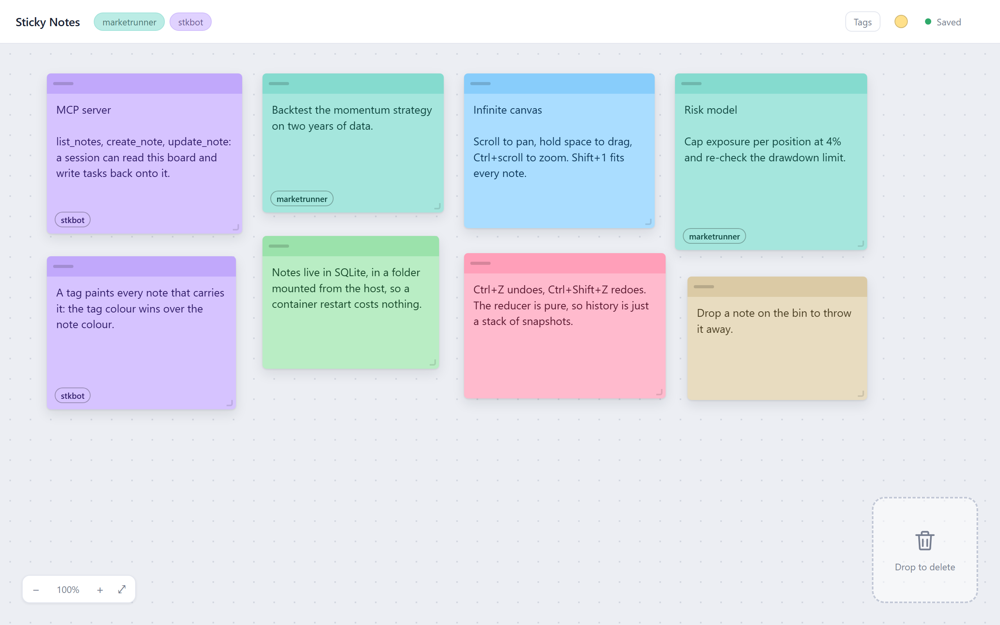

# Sticky Notes



An endless board where sticky notes are created, moved, resized, tagged and thrown away with the
mouse. A tag carries a colour, and it paints every note that carries it.

## Stack

TypeScript · React 19 · Vite 8 · CSS Modules, with the notes kept in SQLite behind a Node server
that has no dependencies of its own. No UI, state or drag-and-drop libraries.

## Running it

```bash
docker compose up -d      # http://127.0.0.1:8787, back up whenever docker is
```

The board lives in `./data`, mounted into the container, so a restart costs nothing.

## Working on it

```bash
npm install
npm run server            # api on 8787
npm run dev               # client on 5173, proxying /api
npm test
```

A Claude Code session reaches the same board through the MCP server in `mcp/`, declared in
`.mcp.json`.
